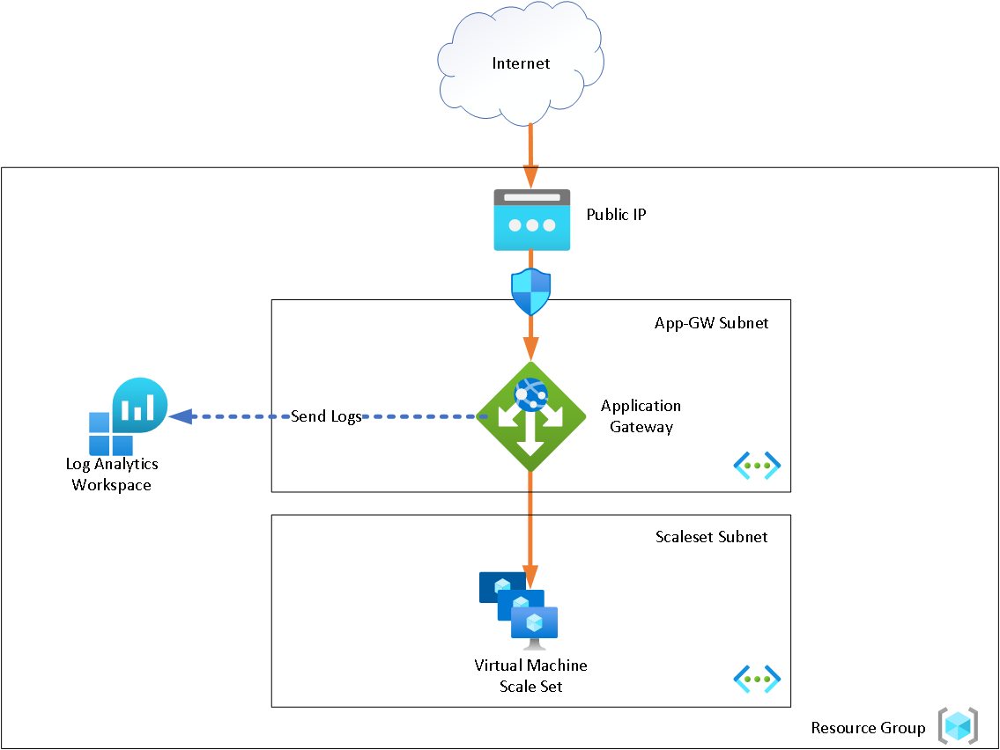

### Introduction
This repo is an example of me learning how modules can be used within terraform for code reusability. This logic becomes important as your TF code starts to increase in size and complexity.

This code creates within Azure a simple website running on a virtual machine scaleset, accessible via a application gateway. A analytics workspace is used to query traffic from the application gateway. 



The following Azure services are used:
- Application Gateway
- Log Analytics Workspace
- Storage Account
- Virtual Machine Scale Set

By default this is deployed to the `Australia East` region.

Currently there's an issue with assigning a network security group to the application gateway - it believes the nsg is blocking app gw v2 traffic when it isn't. Resolve by re-applying.

### System Requirements
The following is required:
- Terraform 0.14

### Usage
#### Step 1 - Credentials
You will need to create a file called `provider.tf` as per below. Populate with appropriate values
```
provider "azurerm" {
  subscription_id = "<<value>>"
  client_id       = "<<value>>"
  client_secret   = "<<value>>"
  tenant_id       = "<<value>>"
  features {}
}
```
#### Step 2 - Modify Default values (optional)
Modify the default values in `variables.tf` to suit your requirements

#### Step 3 - Terraform Run
Change the current directory to `azure_appgw-scaleset_terraform` and execute the following  
```
$ terraform init
$ terraform plan
$ terraform apply
```

```
Apply complete! Resources: 18 added, 0 changed, 0 destroyed.

Outputs:

PublicIP_ofApplicationGateway = "12.34.56.78"
```

### Cleanup Tasks
#### Destroy Azure Resources
```
terraform destroy
```
